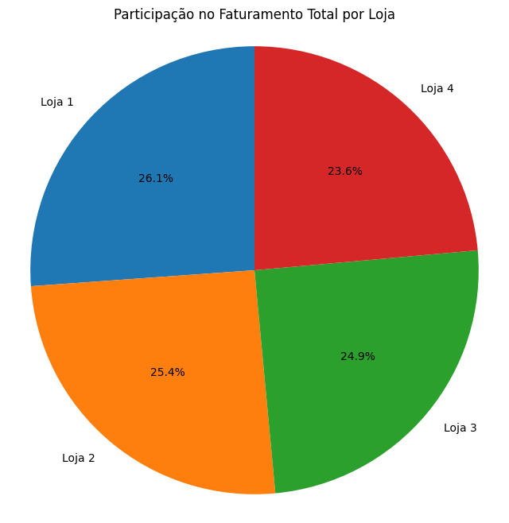
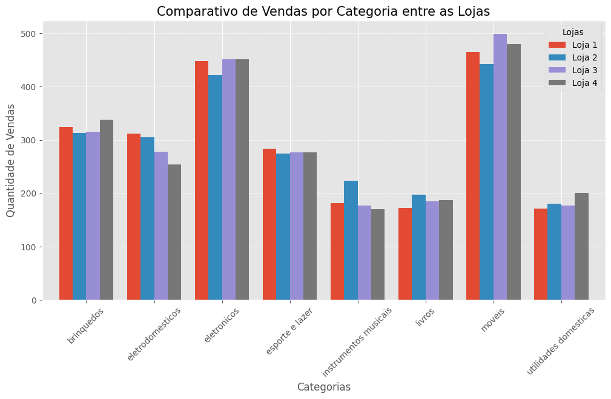
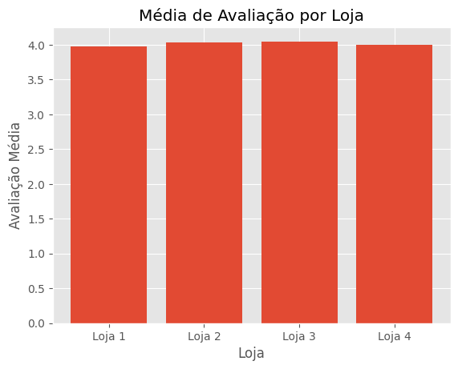
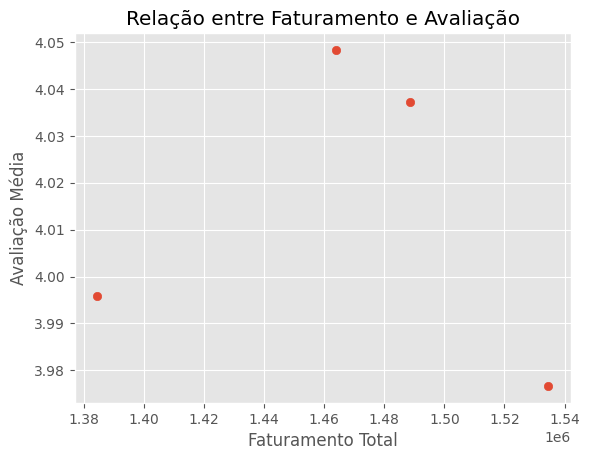

# 📊 Análise de Desempenho – Alura Store

## 📌 Contexto do Case

Projeto desenvolvido como parte do desafio da Especialização em Data Science do programa ONE (Oracle Next Education) – G9.

No desafio, atuei como cientista de dados responsável por analisar o desempenho das quatro lojas da rede fictícia Alura Store.  

O objetivo foi apoiar a decisão estratégica do Sr. João, que deseja vender uma das unidades para investir em um novo empreendimento.

---

## 🎯 Problema de Negócio

Identificar qual loja apresenta o menor desempenho comparativo com base em indicadores financeiros, operacionais e de satisfação do cliente.

---

## 📂 Base de Dados

Os dados foram disponibilizados pela Alura em formato CSV e incluem:

- Produto  
- Categoria  
- Preço  
- Frete  
- Data da compra  
- Avaliação do cliente  
- Localização geográfica  

Cada loja possui seu próprio dataset.

---

# 📈 1. Faturamento Total

O faturamento total foi utilizado como principal indicador de desempenho financeiro.

A Loja 4 apresenta a menor participação percentual no faturamento total da rede.

---

# 💰 2. Ticket Médio

Além do faturamento total, foi analisado o ticket médio por loja.

A Loja 4 também apresenta o menor ticket médio, indicando menor geração de valor por venda quando comparada às demais unidades.

Esse fator reforça o desempenho financeiro inferior observado.

---

# 📦 3. Vendas por Categoria

Foi realizada análise comparativa das categorias de produtos entre as lojas.

Observa-se que todas as lojas possuem portfólio diversificado.  
A Loja 4 não apresenta fragilidade estrutural, mas também não demonstra vantagem competitiva relevante.

---

# ⭐ 4. Avaliação dos Clientes

A média de avaliação foi analisada para verificar impacto da experiência do cliente.

As quatro lojas mantêm média próxima de 4 pontos, indicando nível satisfatório de atendimento.  
Não há diferença significativa que justifique decisão baseada exclusivamente nesse critério.

---

# 📊 5. Relação entre Faturamento e Avaliação

Foi analisada a relação entre receita e satisfação.

Não há correlação direta entre maior faturamento e melhor avaliação.

---

# 🚚 6. Frete Médio

O custo médio de frete também foi considerado.

A Loja 4 apresenta o menor frete médio da rede, indicando eficiência logística.  
No entanto, essa vantagem não compensa o menor desempenho financeiro.

---

# 🌎 7. Distribuição Geográfica das Vendas

Foi realizada análise exploratória das coordenadas das vendas.

A distribuição espacial é semelhante entre as lojas, não havendo fator regional determinante para a diferença de desempenho.

---

# 🧾 Conclusão Final

A Loja 4 apresenta:

- Menor faturamento total  
- Menor ticket médio  
- Desempenho financeiro inferior consistente  
- Ausência de diferencial competitivo nas demais métricas  

Apesar de possuir frete competitivo e boa avaliação dos clientes, seu desempenho global é inferior ao das demais unidades.

**Recomendação:**  
A Loja 4 deve ser a unidade escolhida para venda, permitindo que o capital obtido seja direcionado ao novo investimento estratégico do Sr. João.

---

## 🛠 Tecnologias Utilizadas

- Python  
- Pandas  
- Matplotlib  
- Google Colab  

---

## 👩‍💻 Autora

Danielli Arçari  
Projeto desenvolvido no âmbito do programa ONE – Oracle Next Education.

