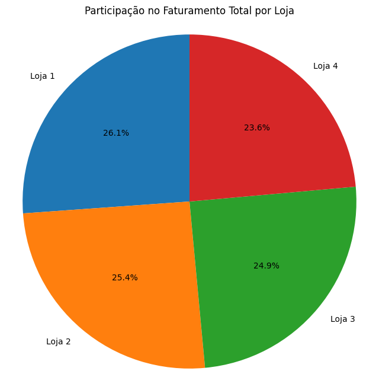
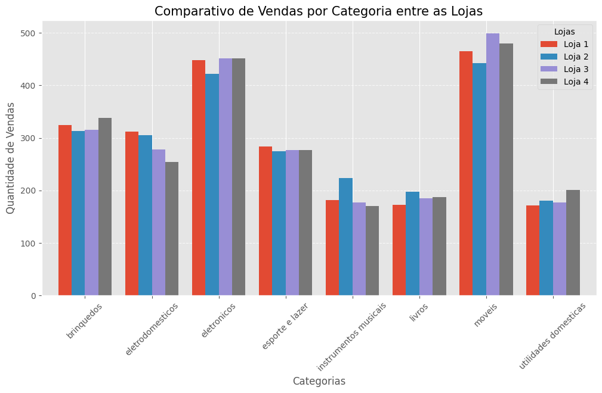
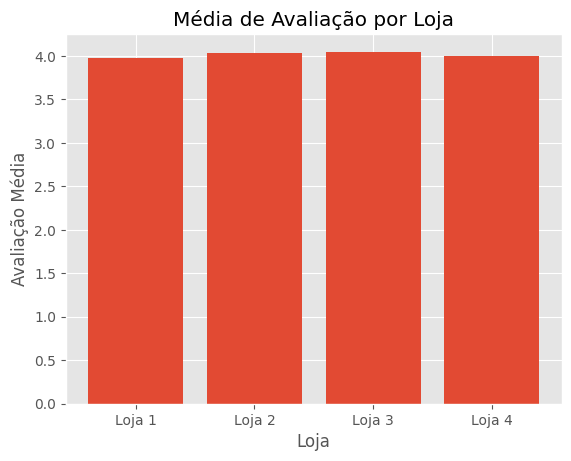
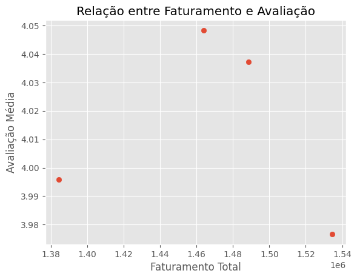
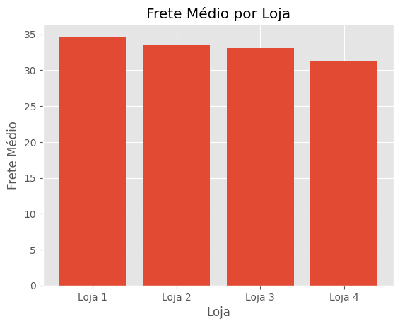
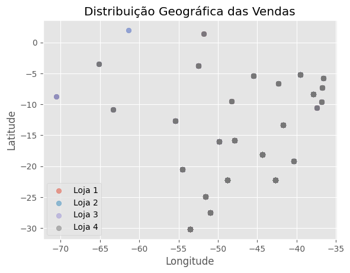

# 📊 Análise de Desempenho – Alura Store

## 📌 Visão Geral

Projeto de **análise exploratória de dados (EDA)** desenvolvido para avaliar o desempenho de quatro lojas da rede fictícia **Alura Store** e apoiar uma decisão estratégica de negócio.

A análise busca identificar qual unidade apresenta o **menor desempenho comparativo**, fornecendo suporte analítico para a decisão de venda de uma das lojas.

Projeto realizado no contexto da especialização em **Data Science do programa ONE – Oracle Next Education**.

---

## 🎯 Problema de Negócio

O Sr. João, proprietário da rede Alura Store, deseja vender uma das quatro lojas para investir em um novo empreendimento.

A análise de dados foi conduzida para responder à seguinte pergunta:

**Qual loja apresenta o pior desempenho e deveria ser vendida?**

---

## 🔧 Tecnologias Utilizadas

- Python  
- Pandas  
- Matplotlib  
- Google Colab  
- Análise Exploratória de Dados (EDA)

---

## 📂 Base de Dados

Os dados foram disponibilizados pela Alura em formato **CSV** e incluem informações sobre vendas realizadas em quatro lojas.

Variáveis presentes na base:

- Produto  
- Categoria  
- Preço  
- Frete  
- Data da compra  
- Avaliação do cliente  
- Localização geográfica  

Cada loja possui seu próprio conjunto de dados.

---

# 📈 Análises Realizadas

## 1️⃣ Faturamento Total

O faturamento total foi utilizado como principal indicador de desempenho financeiro das lojas.

**Resultado**

A **Loja 4 apresenta a menor participação no faturamento total da rede**, indicando desempenho financeiro inferior.

---

## 💰 2️⃣ Ticket Médio

O ticket médio foi analisado para avaliar o valor médio das compras realizadas em cada loja.

**Resultado**

A **Loja 4 apresenta o menor ticket médio**, sugerindo menor geração de valor por venda em comparação às demais unidades.

---

## 📦 3️⃣ Vendas por Categoria

Foi realizada análise comparativa das categorias de produtos entre as lojas.

**Observação**

Todas as lojas apresentam portfólio diversificado, sem diferenças estruturais relevantes entre categorias.

---

## ⭐ 4️⃣ Avaliação dos Clientes

A média de avaliação foi analisada para avaliar a experiência do cliente.

**Resultado**

As quatro lojas possuem média próxima de **4 estrelas**, indicando satisfação geral positiva dos clientes.

---

## 📊 5️⃣ Relação entre Faturamento e Avaliação

Foi analisada a relação entre faturamento e satisfação dos clientes.

**Resultado**

Não foi identificada correlação significativa entre faturamento e avaliação dos clientes.

---

## 🚚 6️⃣ Frete Médio

O custo médio de frete também foi analisado.

**Resultado**

A **Loja 4 apresenta o menor frete médio**, indicando eficiência logística. No entanto, essa vantagem não compensa seu menor desempenho financeiro.

---

## 🌎 7️⃣ Distribuição Geográfica das Vendas

Foi realizada análise exploratória da distribuição geográfica das vendas.

**Resultado**

A distribuição espacial das vendas é semelhante entre as lojas, indicando ausência de fator regional determinante.

---

# 🔎 Principais Insights

A análise comparativa das métricas revelou que:

- A **Loja 4 possui o menor faturamento da rede**
- Apresenta também o **menor ticket médio**
- Não apresenta vantagem competitiva significativa nas demais métricas
- Possui bom desempenho logístico (frete menor), mas isso não compensa o desempenho financeiro inferior

---

# 🧾 Conclusão

Com base na análise dos indicadores financeiros, operacionais e de satisfação do cliente, conclui-se que:

**A Loja 4 apresenta o menor desempenho geral entre as unidades da rede.**

Dessa forma, a recomendação estratégica é que **a Loja 4 seja a unidade escolhida para venda**, permitindo que o capital obtido seja direcionado ao novo investimento planejado.

---

## 👩‍💻 Autora

**Danielli Arçari**

Estudante de Ciência da Computação com foco em **Análise de Dados e Business Intelligence**.

🔗 Portfólio  
https://danielliarcari.vercel.app

🔗 GitHub  
https://github.com/danielli-arcari

